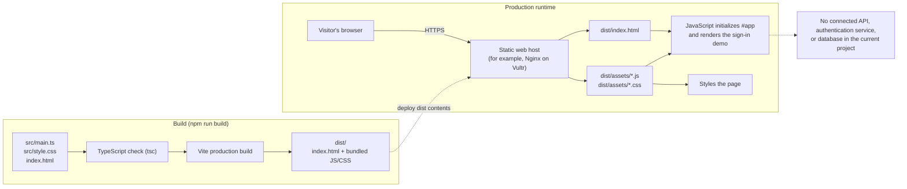

# Chuxmart Architecture

```mermaid
flowchart LR
  subgraph Build["Build (npm run build)"]
    Source["src/main.ts<br/>src/style.css<br/>index.html"] --> TypeCheck["TypeScript check (tsc)"]
    TypeCheck --> Vite["Vite production build"]
    Vite --> Output["dist/<br/>index.html + bundled JS/CSS"]
  end

  subgraph Runtime["Production runtime"]
    Visitor["Visitor's browser"] -->|"HTTPS"| Host["Static web host<br/>(for example, Nginx on Vultr)"]
    Host --> Page["dist/index.html"]
    Host --> Assets["dist/assets/*.js<br/>dist/assets/*.css"]
    Page --> App["JavaScript initializes #app<br/>and renders the sign-in demo"]
    Assets --> App
    Assets --> Styles["Styles the page"]
  end

  Output -. "deploy dist contents" .-> Host

  Missing["No connected API, authentication service,<br/>or database in the current project"]
  App -.-> Missing
```

In development, Vite serves the project locally. For production, the host serves
the generated `dist` files; the host itself is not configured by this project.
